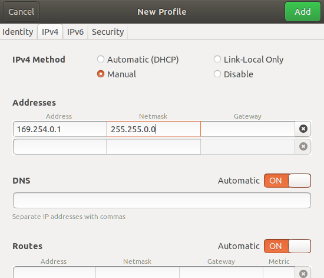

# Arena SDK with OpenCV for C++ on Ubuntu 18.04
This repo showcases functionality of a Lucid Helios (v1) time-of-fligh camera. The code was written and tested on Ubuntu 18.04 with OpenCV 4.6.

# Prerequisites

## OpenCV 
Install OpenCV for C++. Confirm the installation was successful by running the following command in a terminal
```
pkg-config --modversion opencv4
```
If OpenCV is installed, this will output its version.

## Camera setup
Follow the instructions at https://thinklucid.com/getting-started/#gs-Helios-Connect.

## SDK download 
Follow the instructions at https://thinklucid.com/getting-started/#gs-Download-Arena. With the SDK downloaded, follow the instructions in the SDK's README file. 

## Network setup
1. Open Settings.
2. Navigate to Network. 

<p align="center">
    
</p>

3. Add a new wired profile (click the + symbol)
4. Set the profile settings as follows 
    - Choose arbitrary name
    - MAC address - if you have more options than one, pick the one assigned with the default profile
    - IPv4
        - *IP* 169.254.0.1
        - *Subnet* 255.255.0.0
    - You do not need to setup IPv6 or Security

<p align="center">
    
    
</p>

5. Select the new profile. You might need to turn the wired connection off and on again for change to take effect. 
6. To confirm that the camera can be find on the network, run the following commands
```
cd /PATH/TO/ARENA_SKD/precompiledExamples
./IpConfigUtility /list
```
If a camera is available on the networ, the output should list the camera and its settings - *MAC, IP, SUBNET, GATEWAY, IP_CONFIG*.


# How to compile and run this repo
First, download and compile this repo with 
```
git clone https://github.com/daniellehot/helios_depth_stream
cd helios_depth_stream
make
```
An executable should appear in the folder. You can run it with
 ```
 ./main -input_arg1 -input_arg2
 ```
|input_arg1|Description|
|----------|--------------------------------------------------------------------------------------------------|
| -gray    | Capture an intensity image, and visualise it as a grayscale image.                               |
| -heatmap | Capture depth data, apply heatmap based on the measured depth, and visualise it as an RGB image. |
| -ply     | Capture depth data, save it as a ply file.                                                       |
| -stream  | Stream intensity data.                                                                           |
| -depth   | Get depth map and visualise the intensity data as a grayscale image                              |

|input_arg2|Description|
|----------|--------------------------------------------------------------------------------------------------|
| -1500    | Operating mode is set to Distance1500mm (Near Mode). This mode operates at 30 FPS.               |
| -6000    | Operating mode is set to Distance6000mm (Far Mode). This mode operates at 15 FPS.                |

For example, 
```
./main -stream -6000
``` 
will launch stream in a Far Mode.

For help, you can run
```
./main -help
```

# Sources
Most of the code in this repo was sourced from the examples provided with the Arena SDK. Function get_depth_map() was sourced from the code available on via this link https://support.thinklucid.com/app-note-helios-3d-point-cloud-with-rgb-color/.

# Contact information
Daniel Lehotsky<br/>
Aalborg University<br/>
dale@create.aau.dk